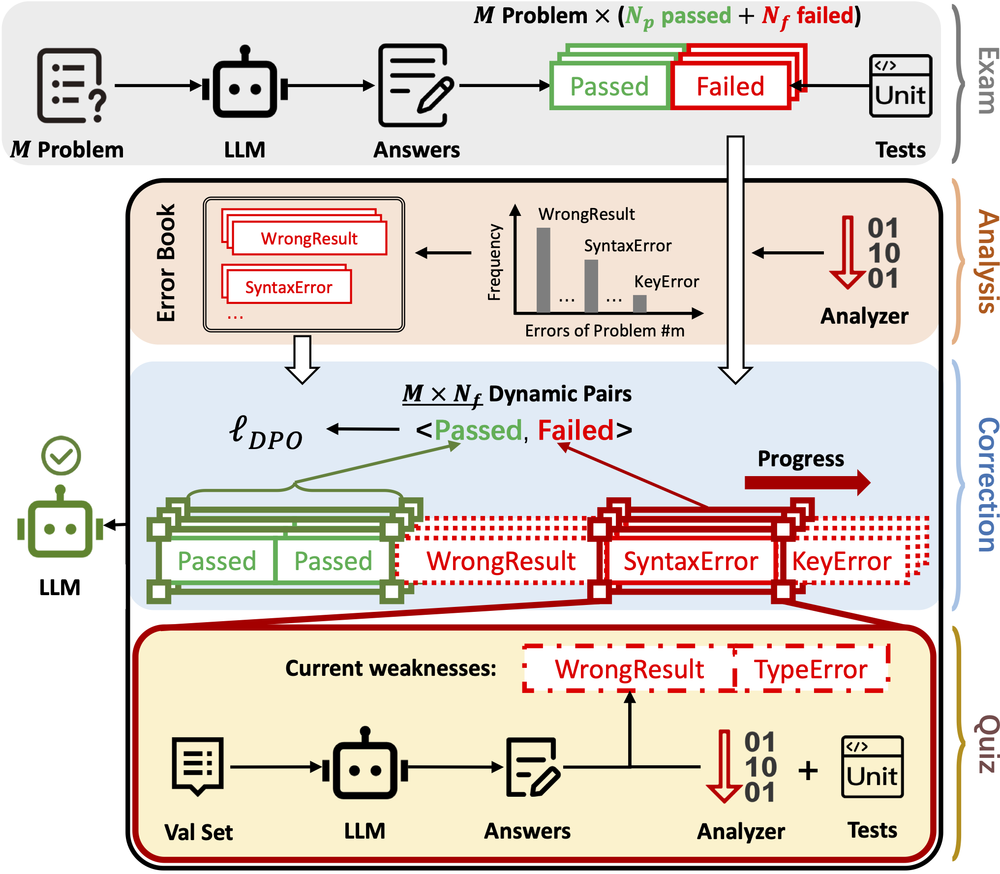
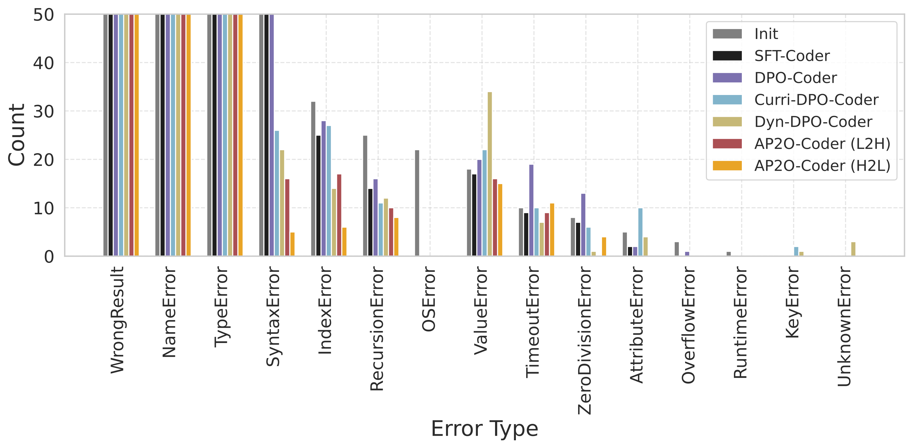
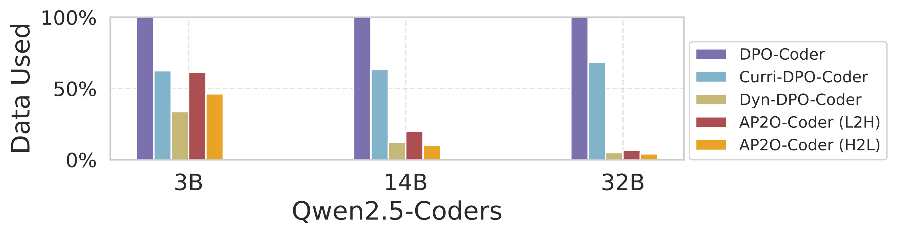
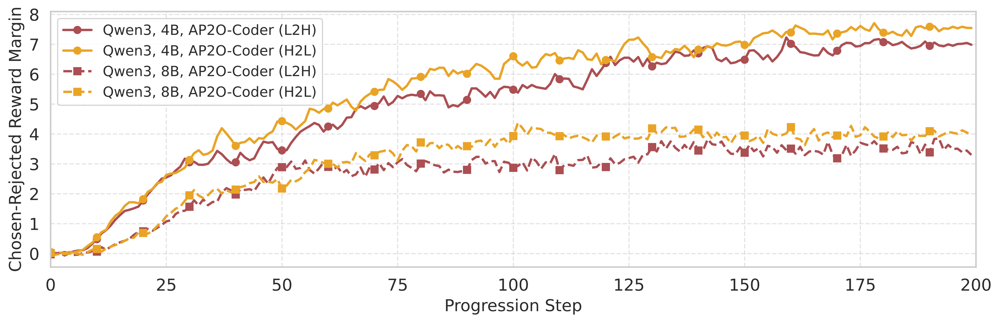

## Introduction

This is the official implementation of our paper [*AP2O-Coder: Adaptively Progressive Preference Optimization for Reducing Compilation and Runtime Errors in LLM-Generated Code*](https://arxiv.org/abs/2510.02393). Accepted by AAAI'26.

- [Slides](./AP2O.pdf)


Adaptive Progressive Preference Optimization


Coding Error Reduction


Data Efficiency


Reward Curves

## Requirements
- deepspeed 0.17.2
- python 3.11.11 
- torch 2.7.0
- trl 0.14.0
- transformers 4.51.3
- vllm 0.9.2

## Usage

To initiate the preference data self-generation and preference optimization processes, use the following command:

```bash
sh pipe-qwen2.5-coder.sh
```